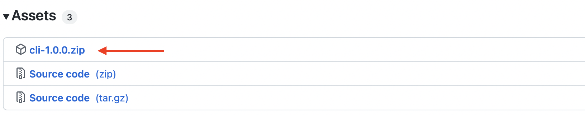

# Command Line Interface (CLI)

[](https://github.com/Tsygankov-Slava/cli/actions/workflows/build.yml)


CLI - это библиотека, которая помогает разработчику в написании консольных приложений. С помощью этого проекта, программист сможет легко наладить общение пользователя с программой через консоль. Плюс этого проекта в том, что разработчику не придётся каждый раз прописывать свою логику CLI, стоит лишь добавить эту библиотеку в свой проект и можно смело использовать её в своей программе.

# Оглавление

- [ Рекомендованные требования инструментов для разработки этого проекта](#рекомендованные-требования-инструментов-для-разработки-этого-проекта)
- [Установка](#установка)
- - [Для пользователя](#для-пользователя)
- - [Для разработчика CLI](#для-разработчика-CLI)
- [Описание](#описание)
- [Пример использования](#пример-использования)

# Рекомендованные требования инструментов для разработки этого проекта

> - Версия CMake: 3.20
> - Версия Clang-Tidy: 13.0.0
> - Стандарт C++: 14
> - Версия Python: 3.1 (нужен если Вы сами собираетесь собирать библиотеку из исходников)

[🔝Оглавление](#оглавление)

# Установка

### Для пользователя

Чтобы получить готовую библиотеку нужно :

1. Зайти в Releases и выбрать подходящую версию CLI (Рекомендовано использовать последнюю версию проекта)
2. После следует найти архив с названием `cli-version.zip` (где `version` это версия релиза) и скачать

3. Распакуйте загруженный архив и переместите библиотеку `cli.hpp` в ваш проект (библиотека будет находиться в папке `build/`)
4. Подключите библиотеку в свою программу с помощью `#include` 

Подробности смотреть в разделе ["Пример использования"](#пример-использования)

### Для разработчика CLI

Если Вы хотите вносить вклад в этот проект и заниматься разработкой этого CLI, то для этого Вам потребуется:

1. Открыть терминал и клонировать репозиторий

```
$ git clone https://github.com/Tsygankov-Slava/cli.git
```

2. Перейти в папку с проектом

```
$ cd cli 
```

3. Подключить проект googletest, как submodule

```
$ git submodule update --init --recursive   
```

4. Внести желаемые изменения в код и при необходимости добавьте тесты в файл `tests/test`
5. Прогоните код по тестам, для этого запустите файл `test` (Этот файл собирается автоматически вместе со всем проектом)
6. Если при разработке `CLI` Вы добавили новые файлы, нужно будет открыть скрипт питона `build-lib.py` и добавить нужные пути в список `paths` (❗Порядок файлов в списке важен, иначе библиотека просто не скомпилируется во время использования её в коде)
7. Собрать библиотеку для дальнейшего использования её в проекте. Для сборки библиотеки воспользуемся командой `make`, находясь в каталоге `cli/`

```
$ make
```

P.S. Чтобы использовать команду make, убедитесь что у вас установлен `python`. Потому что сборкой библиотеки занимается скрипт написанный на `python`.

8. После выполнения команды `make` создастся директория `build/` в которой будет находиться собранная библиотека `cli.hpp`

P.S. Если вдруг Вам понадобится удалить директорию `build/`, просто выполните команду `make clean`
```
$ make clean
```

[🔝Оглавление](#оглавление)

# Описание

При использовании CLI стоит различать два понятия `команда` и `флаг`.
Нужно понимать, что пользователь вводит `команду`, когда хочет выполнить какое-то действие, а `флаг` он вводит для того, чтобы указать, что действие `команды` будет выполняться по каким-то правилам и с какими-то переданными значениями. \
Исходя из вышесказанного, можно вывести одно очень простое правило: 

> ❗ Команда может содержать некое количество флагов, но не наоборот.

### Некоторые правила использования:

1. Для того чтобы начать использовать наш CLI сначала надо создать объект `Cli`:

```c++
auto cli = cli::Cli();
```

> P.S. При создании объекта можно в параметры передать размер описания команд и флагов в консоли
> ```c++
> auto cli = cli::Cli(20);
> ```
> ❗ По умолчанию стоит 50 символов.
> 
> Примеры: 
> - 50 символов:
> ```
> Command:
> help                               Show help information.
> ```
> - 10 символов:
> ```c++
> Command:
> help                               Show help inf-
>                                    ormation.
> ```
> ❗ При использовании этой функции стоит обращать внимание, что существует реализация переноса слов.  
> Перенос работает по правилу "не оставлять меньше 3 символов до/после дефиса".

2. Чтобы описать `команду` нужно использовать следующий синтаксис: 

```c++
command(name, description, example, {flags}, action);
```
| Поле          | Тип               | Описание                                                         |
|---------------|-------------------|------------------------------------------------------------------|
| `name`        | `string`          | имя команды                                                      |
| `description` | `string`          | описание команды                                                 |
| `example`     | `string`          | пример использования команды                                     |
| `flags`       | `Flags`           | задаются флаги                                                   |
| `action`      | `CommandCallback` | имя функции, которая будет выполняться при вызове данной команды |
  
>```c++
>❗ Тип Flags - множество объектов класса Flag (как определять Flag показывается ниже)
>```
>``` c++
>❗ Тип CommandCallback ~ std::function<void(std::map<std::string, Flag> &)>
>```

3. Чтобы описать `флаг` нужно использовать следующий синтаксис:

```c++
Flag(name, shortName, description, isRequired, withValue)
```

| Поле          | Тип        | Описание                                                                     |
|---------------|------------|------------------------------------------------------------------------------|
| `name`        | `string`   | полное имя флага                                                             |
| `shortName`   | `string`   | сокращённое имя флага                                                        |
| `description` | `string`   | описание флага                                                               |
| `isRequired`  | `bool`     | логическое значение, устанавливающее обязательный ли флаг или нет            |
| `withValue`   | `bool`     | логическое значение, устанавливающее прилагается ли к флагу аргумент или нет |
 
> P.S. полное имя флага вызывается с двумя дефисами `--`, сокращённое имя флага с одним дефисом `-`. \
> Пример: 
> - полное имя `--flag`  
> - сокращённое имя `-f`

4. В конце нужно обязательно вызвать функцию `parse` с аргументами `argc` и `argv`.

> В данной версии CLI присутствует само-документирование. Существует по умолчанию команда `help`, которая собирает информацию о командах и флагах и выводит её. \
> Также можно посмотреть информации по отдельной команде или определенному множеству команд.
> ``` 
> $ help 
> ```
> ``` 
> $ help command
> ```
> ``` 
> $ help command1 command2
> ```

> Также можно контролировать цвет выводимой информации в консоль. \
> По умолчанию вывод всей информации (документации или ошибок) стоит в цвете, но если запустить выполнение программы с флагом `--nocolor`, то весь вывод будет в стандартном белом цвете.

❗ Для полного понимая того, как использовать CLI в своём коде, см. раздел ["Пример использования"](#пример-использования)

[🔝Оглавление](#оглавление)

# Пример использования

```c++
//#include "Cli/Cli.hpp"
#include "../build/cli.hpp"// Подключаем нашу библиотеку для использования CLI (путь до библиотеки может отличаться)

void func(cli::FlagsType &parsedFlags); // Объявляем функцию, которая будет вызывать при вызове команды printHello
void func2(cli::FlagsType &parsedFlags);// Объявляем функцию, которая будет вызывать при вызове команды printName

int main(int argc, char **argv) {
    auto cli = cli::Cli();
    try {
        cli.command("printHello", "Displays the word \"Hello!\".", "$ printHello \n>>> Hello!", {}, func)// Добавляем команду printHello
           .command("printName", "Displays \"Hello [entered name]!\".", "$ printName -n Name\n>>> Hello Name!",
                {
                    cli::Flag("name", "n", "A flag that accepts a name as input.", true, true),
                    cli::Flag("surname", "s", "A flag that accepts a surname for entry.", true, true)
                }, func2)                   // Добавляем команду printName и указываем флаги name и surname
           .parse(argc, argv);               // Обязательно вызываем функцию parse c аргументами argc и argv
    } catch (const std::invalid_argument &error) {// Обрабатываем какие-либо ошибки
        std::cout << error.what() << "\n"; // // Обязательно при выводе ошибок поставить символ переноса строки, иначе возможен вывод странных символов
        return 2;// код завершения программы при ошибке
    }
    return 0;
}

void func(cli::FlagsType &parsedFlags) {// Определение функции команды printHello
    std::cout << "Hello!\n";
}

void func2(cli::FlagsType &parsedFlags) {// Определение функции команды printName
    std::cout << "Hello " << parsedFlags.at("name").value << " " << parsedFlags.at("surname").value << "!\n";
}
```

### Примеры запуска в терминале:

```
$ ./cli printHello
Hello!
```

```
$ ./cli printName -n Vanya -s Sidorov
Hello Vanya Sidorov!
```

```
$ ./cli help
CLI version 0.2.0

Usage:
   command [flags] [arguments]

Commands:
  help                               Displays background information and prompts all kinds of commands
  printHello                         Displays the word "Hello!"
  printName                          Displays "Hello [entered name]!"
    Flags:
      -n, --name=VALUE[REQUIRED]     A flag that accepts a name as input
      -s, --surname=VALUE[REQUIRED]  A flag that accepts a surname for entry
```

```
$ ./cli -f --nocolor
ERROR: Unknown flag -> "-f"
```

```
$ ./cli printHello -f --nocolor
Hello!
ERROR: An unknown flag has been entered for the command "printName" -> "-f"
```

```
$ ./cli cmd --nocolor
ERROR: Unknown command -> "cmd"
```

```
$ ./cli printName --nocolor
ERROR: Required flag not entered -> "--name" OR "-n"
```

```
./cli printName -n --nocolor
ERROR: Flag "--name" must accept an argument
```

[🔝Оглавление](#оглавление)

